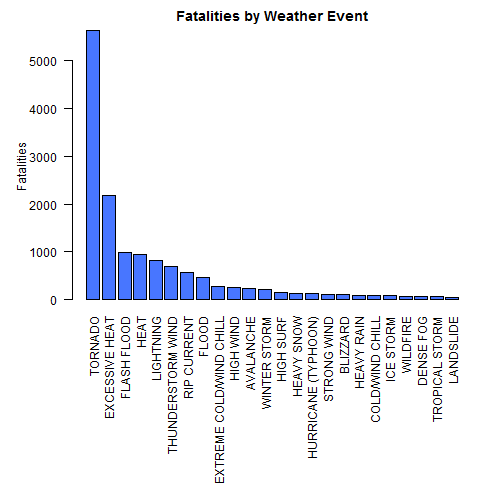
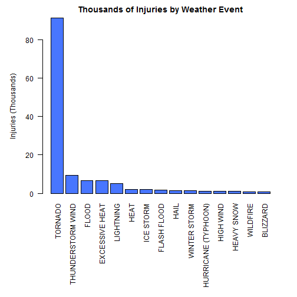
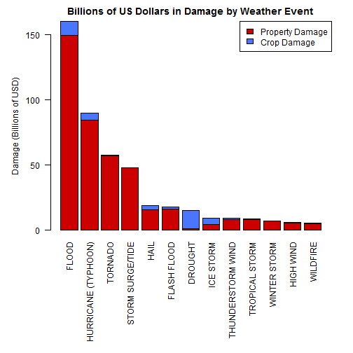

###Synopsis


Severe weather events can have a negative impact on both the health and economies of communities. Using data from the U.S. National Oceanic and Atmospheric Administration (NOAA), the severe weather events with the largest health and economic impacts can be determined. 

The largest weather event contributors, totaling 95% of the health or economic impact, will be the focus of this analysis. To determine a high level understanding of which events have the largest population health impact, total fatalities and injuries were grouped by event type. For determining the weather events with the largest economic impact, the total property and crop damages were grouped by weather events. Event types with the largest impacts will then be presented.


###Data Processing


The first step is to load libraries and the NOAA dataset from the raw "CSV.bz2" format.


```r
##Data Processing

#Load the csv.bz2 file containing weather event data
dataset = read.csv("repdata-data-StormData.csv.bz2", stringsAsFactors=FALSE)

##Load Libraries
library(sqldf)
library(plyr)
library(stringdist)
```


```r
#Display Data format
head(dataset)
```

```
##   STATE__           BGN_DATE BGN_TIME TIME_ZONE COUNTY COUNTYNAME STATE
## 1       1  4/18/1950 0:00:00     0130       CST     97     MOBILE    AL
## 2       1  4/18/1950 0:00:00     0145       CST      3    BALDWIN    AL
## 3       1  2/20/1951 0:00:00     1600       CST     57    FAYETTE    AL
## 4       1   6/8/1951 0:00:00     0900       CST     89    MADISON    AL
## 5       1 11/15/1951 0:00:00     1500       CST     43    CULLMAN    AL
## 6       1 11/15/1951 0:00:00     2000       CST     77 LAUDERDALE    AL
##    EVTYPE BGN_RANGE BGN_AZI BGN_LOCATI END_DATE END_TIME COUNTY_END
## 1 TORNADO         0                                               0
## 2 TORNADO         0                                               0
## 3 TORNADO         0                                               0
## 4 TORNADO         0                                               0
## 5 TORNADO         0                                               0
## 6 TORNADO         0                                               0
##   COUNTYENDN END_RANGE END_AZI END_LOCATI LENGTH WIDTH F MAG FATALITIES
## 1         NA         0                      14.0   100 3   0          0
## 2         NA         0                       2.0   150 2   0          0
## 3         NA         0                       0.1   123 2   0          0
## 4         NA         0                       0.0   100 2   0          0
## 5         NA         0                       0.0   150 2   0          0
## 6         NA         0                       1.5   177 2   0          0
##   INJURIES PROPDMG PROPDMGEXP CROPDMG CROPDMGEXP WFO STATEOFFIC ZONENAMES
## 1       15    25.0          K       0                                    
## 2        0     2.5          K       0                                    
## 3        2    25.0          K       0                                    
## 4        2     2.5          K       0                                    
## 5        2     2.5          K       0                                    
## 6        6     2.5          K       0                                    
##   LATITUDE LONGITUDE LATITUDE_E LONGITUDE_ REMARKS REFNUM
## 1     3040      8812       3051       8806              1
## 2     3042      8755          0          0              2
## 3     3340      8742          0          0              3
## 4     3458      8626          0          0              4
## 5     3412      8642          0          0              5
## 6     3450      8748          0          0              6
```


With the data and libraries loaded, the analysis can begin on preparing the population health data. The first step of the analysis is to perform summations on the fatalities and injuries data, and to organize these totals by event type.


```r
## Population Health Data Processing

fatalities_summary = arrange  (
  ddply( dataset,~EVTYPE,summarise,
         sum_fatalities=sum(FATALITIES)),
  desc(sum_fatalities)
)

injuries_summary = arrange  (
  ddply( dataset,~EVTYPE,summarise,
         sum_injuries=sum(INJURIES)),
         desc(sum_injuries)
  )
```

```r
head(fatalities_summary)
```

```
##           EVTYPE sum_fatalities
## 1        TORNADO           5633
## 2 EXCESSIVE HEAT           1903
## 3    FLASH FLOOD            978
## 4           HEAT            937
## 5      LIGHTNING            816
## 6      TSTM WIND            504
```

```r
head(injuries_summary)
```

```
##           EVTYPE sum_injuries
## 1        TORNADO        91346
## 2      TSTM WIND         6957
## 3          FLOOD         6789
## 4 EXCESSIVE HEAT         6525
## 5      LIGHTNING         5230
## 6           HEAT         2100
```


With the data summarized by event, the next step is to determine the largest contributors to fatalities and injuries. Since the the fatality and injury summary datasets were ordered to display the largest conributors first, a cumulative summation can be calculated. With the cumulative percent calculation, the highest contributing event types totaling 95% of the fatalities and injuries can be determined.


```r
#Get the total FATALITIES and INJURIES
total_fatalities = sum(fatalities_summary$sum_fatalities)
total_injuries = sum(injuries_summary$sum_injuries)

#Get the cumulative Summation for fatalities
fatalities_summary = cbind (fatalities_summary, 
                        cumsum_fatalities = cumsum(fatalities_summary$sum_fatalities), 
                        cumsum_fatalities_percent = cumsum(fatalities_summary$sum_fatalities) / total_fatalities)

#Get the cumulative Summation for injuries
injuries_summary = cbind (injuries_summary, 
                            cumsum_injuries = cumsum(injuries_summary$sum_injuries), 
                            cumsum_injuries_percent = cumsum(injuries_summary$sum_injuries) / total_injuries)


#Only Get data covering top EVTYPES covering 95% of total Fatalities and Injuries
fatalities_sub = data.frame(subset(fatalities_summary, cumsum_fatalities_percent <= 0.95))
injuries_sub = data.frame(subset(injuries_summary, cumsum_injuries_percent <= 0.95))
```


The subset of data now only holds the top event type contributors, but some of the event type names are synonymous. They also do not fall in line with the event type names as listed in the NOAA reference document. So, the event type names from the original dataset will first be compared to the NOAA reference document event list to find the closest event name. The file "events.csv" can be found [here](https://github.com/jlajeune/Assignment---Weather-Event-Impacts).


```r
#Load the categories expected from the Storm Data Preparation Guide 
# Reference - (NWSI 10-1605 August, 2007, Storm Data Event Table Figure 2.1.1)
reference_event_list = read.csv("events.csv", stringsAsFactors=FALSE)

#Find Closest String match using stringdist library, amatch function.
closest_match_fatalities = toupper(reference_event_list$Events[     
  amatch(
    fatalities_sub$EVTYPE, 
    toupper(reference_event_list$Events), 
    maxDist= 2,
  )
  ])

closest_match_injuries = toupper(reference_event_list$Events[     
  amatch(
    injuries_sub$EVTYPE, 
    toupper(reference_event_list$Events), 
    maxDist= 2,
  )
  ])


#Find The closest matches
fatalities_sub = cbind(fatalities_sub, closest_match_fatalities=as.character(closest_match_fatalities))
injuries_sub = cbind(injuries_sub, closest_match_injuries=as.character(closest_match_injuries))
```

```r
#Print for Manual Comparison
fatalities_sub[,c("EVTYPE", "closest_match_fatalities")]
```

```
##                     EVTYPE closest_match_fatalities
## 1                  TORNADO                  TORNADO
## 2           EXCESSIVE HEAT           EXCESSIVE HEAT
## 3              FLASH FLOOD              FLASH FLOOD
## 4                     HEAT                     HEAT
## 5                LIGHTNING                LIGHTNING
## 6                TSTM WIND                     <NA>
## 7                    FLOOD                    FLOOD
## 8              RIP CURRENT              RIP CURRENT
## 9                HIGH WIND                HIGH WIND
## 10               AVALANCHE                AVALANCHE
## 11            WINTER STORM             WINTER STORM
## 12            RIP CURRENTS              RIP CURRENT
## 13               HEAT WAVE                     <NA>
## 14            EXTREME COLD                     <NA>
## 15       THUNDERSTORM WIND        THUNDERSTORM WIND
## 16              HEAVY SNOW               HEAVY SNOW
## 17 EXTREME COLD/WIND CHILL  EXTREME COLD/WIND CHILL
## 18             STRONG WIND              STRONG WIND
## 19                BLIZZARD                 BLIZZARD
## 20               HIGH SURF                HIGH SURF
## 21              HEAVY RAIN               HEAVY RAIN
## 22            EXTREME HEAT                     <NA>
## 23         COLD/WIND CHILL          COLD/WIND CHILL
## 24               ICE STORM                ICE STORM
## 25                WILDFIRE                 WILDFIRE
## 26       HURRICANE/TYPHOON                     <NA>
## 27      THUNDERSTORM WINDS        THUNDERSTORM WIND
## 28                     FOG                     <NA>
## 29               HURRICANE                     <NA>
## 30          TROPICAL STORM           TROPICAL STORM
## 31    HEAVY SURF/HIGH SURF                     <NA>
## 32               LANDSLIDE                     <NA>
```

```r
#Print for Manual Comparison
injuries_sub[,c("EVTYPE", "closest_match_injuries")]
```

```
##                EVTYPE closest_match_injuries
## 1             TORNADO                TORNADO
## 2           TSTM WIND                   <NA>
## 3               FLOOD                  FLOOD
## 4      EXCESSIVE HEAT         EXCESSIVE HEAT
## 5           LIGHTNING              LIGHTNING
## 6                HEAT                   HEAT
## 7           ICE STORM              ICE STORM
## 8         FLASH FLOOD            FLASH FLOOD
## 9   THUNDERSTORM WIND      THUNDERSTORM WIND
## 10               HAIL                   HAIL
## 11       WINTER STORM           WINTER STORM
## 12  HURRICANE/TYPHOON                   <NA>
## 13          HIGH WIND              HIGH WIND
## 14         HEAVY SNOW             HEAVY SNOW
## 15           WILDFIRE               WILDFIRE
## 16 THUNDERSTORM WINDS      THUNDERSTORM WIND
## 17           BLIZZARD               BLIZZARD
```

Even when using a string matching query, some of the event types were not able to automatically find a match.To account for this, some of the fields need to be updated manually.


```r
#Make sure no columns are factor columns
fatalities_sub[, sapply(fatalities_sub, is.factor)] <- 
    sapply(fatalities_sub[, sapply(fatalities_sub, is.factor)], as.character)
injuries_sub[, sapply(injuries_sub, is.factor)] <- 
  sapply(injuries_sub[, sapply(injuries_sub, is.factor)], as.character)

#Update Fields that had no matching columns found, and reset the main EVTYPE field

fatalities_sub[6,"closest_match_fatalities"] = toupper("Thunderstorm Wind")
fatalities_sub[13,"closest_match_fatalities"] = toupper("Excessive Heat")
fatalities_sub[14,"closest_match_fatalities"] = toupper("Extreme Cold/Wind Chill")
fatalities_sub[22,"closest_match_fatalities"] = toupper("Excessive Heat")
fatalities_sub[26,"closest_match_fatalities"] = toupper("Hurricane (Typhoon)")
fatalities_sub[28,"closest_match_fatalities"] = toupper("Dense Fog")
fatalities_sub[29,"closest_match_fatalities"] = toupper("Hurricane (Typhoon)")
fatalities_sub[31,"closest_match_fatalities"] = toupper("High Surf")
fatalities_sub[32,"closest_match_fatalities"] = toupper("Landslide")

injuries_sub[2,"closest_match_injuries"] = toupper("Thunderstorm Wind")
injuries_sub[12,"closest_match_injuries"] = toupper("Hurricane (Typhoon)")
```

```r
#Print for Manual Comparison Check
fatalities_sub[,c("EVTYPE", "closest_match_fatalities")]
```

```
##                     EVTYPE closest_match_fatalities
## 1                  TORNADO                  TORNADO
## 2           EXCESSIVE HEAT           EXCESSIVE HEAT
## 3              FLASH FLOOD              FLASH FLOOD
## 4                     HEAT                     HEAT
## 5                LIGHTNING                LIGHTNING
## 6                TSTM WIND        THUNDERSTORM WIND
## 7                    FLOOD                    FLOOD
## 8              RIP CURRENT              RIP CURRENT
## 9                HIGH WIND                HIGH WIND
## 10               AVALANCHE                AVALANCHE
## 11            WINTER STORM             WINTER STORM
## 12            RIP CURRENTS              RIP CURRENT
## 13               HEAT WAVE           EXCESSIVE HEAT
## 14            EXTREME COLD  EXTREME COLD/WIND CHILL
## 15       THUNDERSTORM WIND        THUNDERSTORM WIND
## 16              HEAVY SNOW               HEAVY SNOW
## 17 EXTREME COLD/WIND CHILL  EXTREME COLD/WIND CHILL
## 18             STRONG WIND              STRONG WIND
## 19                BLIZZARD                 BLIZZARD
## 20               HIGH SURF                HIGH SURF
## 21              HEAVY RAIN               HEAVY RAIN
## 22            EXTREME HEAT           EXCESSIVE HEAT
## 23         COLD/WIND CHILL          COLD/WIND CHILL
## 24               ICE STORM                ICE STORM
## 25                WILDFIRE                 WILDFIRE
## 26       HURRICANE/TYPHOON      HURRICANE (TYPHOON)
## 27      THUNDERSTORM WINDS        THUNDERSTORM WIND
## 28                     FOG                DENSE FOG
## 29               HURRICANE      HURRICANE (TYPHOON)
## 30          TROPICAL STORM           TROPICAL STORM
## 31    HEAVY SURF/HIGH SURF                HIGH SURF
## 32               LANDSLIDE                LANDSLIDE
```

```r
#Print for Manual Comparison Check
injuries_sub[,c("EVTYPE", "closest_match_injuries")]
```

```
##                EVTYPE closest_match_injuries
## 1             TORNADO                TORNADO
## 2           TSTM WIND      THUNDERSTORM WIND
## 3               FLOOD                  FLOOD
## 4      EXCESSIVE HEAT         EXCESSIVE HEAT
## 5           LIGHTNING              LIGHTNING
## 6                HEAT                   HEAT
## 7           ICE STORM              ICE STORM
## 8         FLASH FLOOD            FLASH FLOOD
## 9   THUNDERSTORM WIND      THUNDERSTORM WIND
## 10               HAIL                   HAIL
## 11       WINTER STORM           WINTER STORM
## 12  HURRICANE/TYPHOON    HURRICANE (TYPHOON)
## 13          HIGH WIND              HIGH WIND
## 14         HEAVY SNOW             HEAVY SNOW
## 15           WILDFIRE               WILDFIRE
## 16 THUNDERSTORM WINDS      THUNDERSTORM WIND
## 17           BLIZZARD               BLIZZARD
```

With the corrected matching event type names determined, the main "EVTYPE" parameter will be updated. Since there may be duplicate entries, the data will need to be summarized again to group all of the data correctly.


```r
#Update the EVTYPE Values
fatalities_sub[,"EVTYPE"] = fatalities_sub[,"closest_match_fatalities"]
injuries_sub[,"EVTYPE"] = injuries_sub[,"closest_match_injuries"]

#Print for Manual Comparison Check
fatalities_sub[,c("EVTYPE", "closest_match_fatalities")]
```

```
##                     EVTYPE closest_match_fatalities
## 1                  TORNADO                  TORNADO
## 2           EXCESSIVE HEAT           EXCESSIVE HEAT
## 3              FLASH FLOOD              FLASH FLOOD
## 4                     HEAT                     HEAT
## 5                LIGHTNING                LIGHTNING
## 6        THUNDERSTORM WIND        THUNDERSTORM WIND
## 7                    FLOOD                    FLOOD
## 8              RIP CURRENT              RIP CURRENT
## 9                HIGH WIND                HIGH WIND
## 10               AVALANCHE                AVALANCHE
## 11            WINTER STORM             WINTER STORM
## 12             RIP CURRENT              RIP CURRENT
## 13          EXCESSIVE HEAT           EXCESSIVE HEAT
## 14 EXTREME COLD/WIND CHILL  EXTREME COLD/WIND CHILL
## 15       THUNDERSTORM WIND        THUNDERSTORM WIND
## 16              HEAVY SNOW               HEAVY SNOW
## 17 EXTREME COLD/WIND CHILL  EXTREME COLD/WIND CHILL
## 18             STRONG WIND              STRONG WIND
## 19                BLIZZARD                 BLIZZARD
## 20               HIGH SURF                HIGH SURF
## 21              HEAVY RAIN               HEAVY RAIN
## 22          EXCESSIVE HEAT           EXCESSIVE HEAT
## 23         COLD/WIND CHILL          COLD/WIND CHILL
## 24               ICE STORM                ICE STORM
## 25                WILDFIRE                 WILDFIRE
## 26     HURRICANE (TYPHOON)      HURRICANE (TYPHOON)
## 27       THUNDERSTORM WIND        THUNDERSTORM WIND
## 28               DENSE FOG                DENSE FOG
## 29     HURRICANE (TYPHOON)      HURRICANE (TYPHOON)
## 30          TROPICAL STORM           TROPICAL STORM
## 31               HIGH SURF                HIGH SURF
## 32               LANDSLIDE                LANDSLIDE
```

```r
injuries_sub[,c("EVTYPE", "closest_match_injuries")]
```

```
##                 EVTYPE closest_match_injuries
## 1              TORNADO                TORNADO
## 2    THUNDERSTORM WIND      THUNDERSTORM WIND
## 3                FLOOD                  FLOOD
## 4       EXCESSIVE HEAT         EXCESSIVE HEAT
## 5            LIGHTNING              LIGHTNING
## 6                 HEAT                   HEAT
## 7            ICE STORM              ICE STORM
## 8          FLASH FLOOD            FLASH FLOOD
## 9    THUNDERSTORM WIND      THUNDERSTORM WIND
## 10                HAIL                   HAIL
## 11        WINTER STORM           WINTER STORM
## 12 HURRICANE (TYPHOON)    HURRICANE (TYPHOON)
## 13           HIGH WIND              HIGH WIND
## 14          HEAVY SNOW             HEAVY SNOW
## 15            WILDFIRE               WILDFIRE
## 16   THUNDERSTORM WIND      THUNDERSTORM WIND
## 17            BLIZZARD               BLIZZARD
```

```r
#Re-summarize Data since there are now matching Event Types

fatalities_final = arrange  (
  ddply(fatalities_sub,~EVTYPE,summarise,
         sum_fatalities=sum(sum_fatalities)),
  desc(sum_fatalities)
)

injuries_final = arrange  (
  ddply( injuries_sub,~EVTYPE,summarise,
         sum_injuries=sum(sum_injuries)),
  desc(sum_injuries)
)
```


The fatality and injury data sets are now cleaned and summarized, so the next step is to analyze the economic impacts of severe weather events.


The first step is to update the crop and property damage based on their units, which are determined by their associated "EXP" fields. A value of "k" or "K" represents thousands of US dollars, a value of "m" or "M" represents millions of US dollars, and a value of "b" or "B" represents billions.


```r
## Economic Impact Data Processing

##Update Damage Crop and Property Values based on the "EXP" fields
# Reference - (NWSI 10-1605 August, 2007, Storm Data Event Table Section 2.7)

dataset$PROPDMG[dataset$PROPDMGEXP == "k"] = dataset$PROPDMG[dataset$PROPDMGEXP == "k"] * 1e3
dataset$PROPDMG[dataset$PROPDMGEXP == "K"] = dataset$PROPDMG[dataset$PROPDMGEXP == "K"] * 1e3

dataset$PROPDMG[dataset$PROPDMGEXP == "m"] = dataset$PROPDMG[dataset$PROPDMGEXP == "m"] * 1e6
dataset$PROPDMG[dataset$PROPDMGEXP == "M"] = dataset$PROPDMG[dataset$PROPDMGEXP == "M"] * 1e6

dataset$PROPDMG[dataset$PROPDMGEXP == "b"] = dataset$PROPDMG[dataset$PROPDMGEXP == "b"] * 1e9
dataset$PROPDMG[dataset$PROPDMGEXP == "B"] = dataset$PROPDMG[dataset$PROPDMGEXP == "B"] * 1e9

dataset$CROPDMG[dataset$CROPDMGEXP == "k"] = dataset$CROPDMG[dataset$CROPDMGEXP == "k"] * 1e3
dataset$CROPDMG[dataset$CROPDMGEXP == "K"] = dataset$CROPDMG[dataset$CROPDMGEXP == "K"] * 1e3

dataset$CROPDMG[dataset$CROPDMGEXP == "m"] = dataset$CROPDMG[dataset$CROPDMGEXP == "m"] * 1e6
dataset$CROPDMG[dataset$CROPDMGEXP == "M"] = dataset$CROPDMG[dataset$CROPDMGEXP == "M"] * 1e6

dataset$CROPDMG[dataset$CROPDMGEXP == "b"] = dataset$CROPDMG[dataset$CROPDMGEXP == "b"] * 1e9
dataset$CROPDMG[dataset$CROPDMGEXP == "B"] = dataset$CROPDMG[dataset$CROPDMGEXP == "B"] * 1e9
```


While most fields are captured with one of these units or a lack of a unit, some of the fields contain unexpected values. The distributions of these units can be determined to help understand what portion of the data is affected by this issue.


```r
#Check to see how many EXP fields are mislabled

sqldf('select PROPDMGEXP, count(*) from dataset group by PROPDMGEXP;')
```

```
##    PROPDMGEXP count(*)
## 1               465934
## 2           +        5
## 3           -        1
## 4           0      216
## 5           1       25
## 6           2       13
## 7           3        4
## 8           4        4
## 9           5       28
## 10          6        4
## 11          7        5
## 12          8        1
## 13          ?        8
## 14          B       40
## 15          H        6
## 16          K   424665
## 17          M    11330
## 18          h        1
## 19          m        7
```

```r
sqldf('select CROPDMGEXP, count(*) from dataset group by CROPDMGEXP;')
```

```
##   CROPDMGEXP count(*)
## 1              618413
## 2          0       19
## 3          2        1
## 4          ?        7
## 5          B        9
## 6          K   281832
## 7          M     1994
## 8          k       21
## 9          m        1
```

```r
total_rows = nrow(dataset)
subset_rows = sqldf('select 
                        count(*)
                     from
                        dataset
                     where
                      (
                        PROPDMGEXP == "k" or
                        PROPDMGEXP == "K" or
                        PROPDMGEXP == "m" or
                        PROPDMGEXP == "M" or
                        PROPDMGEXP == "b" or
                        PROPDMGEXP == "B" or
                        PROPDMGEXP == ""
                      )
                        and
                      (
                        CROPDMGEXP == "k" or
                        CROPDMGEXP == "K" or
                        CROPDMGEXP == "m" or
                        CROPDMGEXP == "M" or
                        CROPDMGEXP == "b" or
                        CROPDMGEXP == "B" or
                        CROPDMGEXP == ""
                      );
                    ')
percent_rows = subset_rows/total_rows
percent_rows
```

```
##    count(*)
## 1 0.9996143
```

```r
# Given that a large majority of the rows are captured with the correct criteria, 
# the data not having a correct EXP value for crop or property damage will be ignored. 
```

Since over 99.9% of the data contains one of the expected values, all rows containing one of the unexpected unit values will be ignored.


```r
#Only include the known unit values
dataset_filtered = subset(dataset, (  ( CROPDMGEXP == "k" | 
                                        CROPDMGEXP == "K" |
                                        CROPDMGEXP == "m" |
                                        CROPDMGEXP == "M" |
                                        CROPDMGEXP == "b" |
                                        CROPDMGEXP == "B" |
                                        CROPDMGEXP == ""
                                      ) &
                                      (
                                        PROPDMGEXP == "k" | 
                                        PROPDMGEXP == "K" |
                                        PROPDMGEXP == "m" |
                                        PROPDMGEXP == "M" |
                                        PROPDMGEXP == "b" |
                                        PROPDMGEXP == "B" |
                                        PROPDMGEXP == "")
                                     ))
```

The next step is to summarize the cumulative crop and property damage for each event type.


```r
# Get a summation of property and crop damage separately, and then sum both categories together. 
# Sort by overall damage decending.
damage_summary = arrange  (
                            ddply( dataset_filtered,~EVTYPE,summarise,
                                   sum_PROPDMG=sum(PROPDMG),
                                   sum_CROPDMG=sum(CROPDMG), 
                                   sum_DMG=sum(PROPDMG + CROPDMG)),
                            desc(sum_DMG)
                          )
```

The cumulative distribution for the total damage costs needs to be calculated. This cumulative summation will determine what the top 95% event types are for economic impact.


```r
#Get the total damage
total_damage = sum(damage_summary$sum_DMG)

#Get the cumulative Summation
damage_summary = cbind (damage_summary, 
                        cumsum_DMG = cumsum(damage_summary$sum_DMG), 
                        cumsum_DMG_percent = cumsum(damage_summary$sum_DMG) / total_damage)

#Only Get data covering top EVTYPES covering 95% of total damage costs
damage_sub = data.frame(subset(damage_summary, cumsum_DMG_percent <= 0.95))
```

With the subset of data selected, the next step is to commonize the event types by comparing to the reference event type list. Close matches will be determined first.


```r
#Find Closest String match using stringdist library, amatch function.
closest_match_damage = toupper(reference_event_list$Events[     
                          amatch(
                                  damage_sub$EVTYPE, 
                                  toupper(reference_event_list$Events), 
                                  maxDist= 2,
                                )
                      ])

#Find The closest matches
damage_sub = cbind(damage_sub, closest_match_damage)

#Print for Manual Comparison
damage_sub[,c("EVTYPE", "closest_match_damage")]
```

```
##               EVTYPE closest_match_damage
## 1              FLOOD                FLOOD
## 2  HURRICANE/TYPHOON                 <NA>
## 3            TORNADO              TORNADO
## 4        STORM SURGE                 <NA>
## 5               HAIL                 HAIL
## 6        FLASH FLOOD          FLASH FLOOD
## 7            DROUGHT              DROUGHT
## 8          HURRICANE                 <NA>
## 9        RIVER FLOOD                 <NA>
## 10         ICE STORM            ICE STORM
## 11    TROPICAL STORM       TROPICAL STORM
## 12      WINTER STORM         WINTER STORM
## 13         HIGH WIND            HIGH WIND
## 14          WILDFIRE             WILDFIRE
## 15         TSTM WIND                 <NA>
## 16  STORM SURGE/TIDE     STORM SURGE/TIDE
## 17 THUNDERSTORM WIND    THUNDERSTORM WIND
## 18    HURRICANE OPAL                 <NA>
```


The remaining event types then need to be manually set to a similar event type category from the reference guide.


```r
#Make sure no columns are factor columns
damage_sub[, sapply(damage_sub, is.factor)] <- 
  sapply(damage_sub[, sapply(damage_sub, is.factor)], as.character)


#Update Fields that had not matchin columns found, and reset the main EVTYPE field
damage_sub[2,"closest_match_damage"] = toupper("Hurricane (Typhoon)")
damage_sub[4,"closest_match_damage"] = toupper("Storm Surge/Tide")
damage_sub[8,"closest_match_damage"] = toupper("Hurricane (Typhoon)")
damage_sub[9,"closest_match_damage"] = toupper("Flood")
damage_sub[15,"closest_match_damage"] = toupper("Thunderstorm Wind")
damage_sub[18,"closest_match_damage"] = toupper("Hurricane (Typhoon)")

#Print for Manual Comparison
damage_sub[,c("EVTYPE", "closest_match_damage")]
```

```
##               EVTYPE closest_match_damage
## 1              FLOOD                FLOOD
## 2  HURRICANE/TYPHOON  HURRICANE (TYPHOON)
## 3            TORNADO              TORNADO
## 4        STORM SURGE     STORM SURGE/TIDE
## 5               HAIL                 HAIL
## 6        FLASH FLOOD          FLASH FLOOD
## 7            DROUGHT              DROUGHT
## 8          HURRICANE  HURRICANE (TYPHOON)
## 9        RIVER FLOOD                FLOOD
## 10         ICE STORM            ICE STORM
## 11    TROPICAL STORM       TROPICAL STORM
## 12      WINTER STORM         WINTER STORM
## 13         HIGH WIND            HIGH WIND
## 14          WILDFIRE             WILDFIRE
## 15         TSTM WIND    THUNDERSTORM WIND
## 16  STORM SURGE/TIDE     STORM SURGE/TIDE
## 17 THUNDERSTORM WIND    THUNDERSTORM WIND
## 18    HURRICANE OPAL  HURRICANE (TYPHOON)
```

With the even type matching list finished, the "EVTYPE" values can be updated. After updating, the data will need to be summarized again due to duplicate event types.


```r
#Reset EVTYPE

damage_sub[,"EVTYPE"] = damage_sub[,"closest_match_damage"]

#Re-summarize Data since there are now matching Event Types

damage_final = arrange  (
  ddply(damage_sub,~EVTYPE,summarise,
        sum_DMG=sum(sum_DMG),
        sum_PROPDMG=sum(sum_PROPDMG),
        sum_CROPDMG=sum(sum_CROPDMG)), 
  desc(sum_DMG)
)
```

With the economic damage data set cleaned and organized, the data is now ready for presenting.


###Results


#### Severe Weather Event Impact on Population Health

Weather events can cause injuries and fatalities, so it's important to understand which event types have the largest impacts on population health.


```r
######Plots for Results Section

#Bar Plots For Fatalities and Injuries

#Rotate the fatalities and injuries data so it can be used by the plotting function
plot_dat_fatalities = t(fatalities_final[,c("sum_fatalities")])
plot_dat_injuries = t(injuries_final[,c("sum_injuries")])
plot_dat_injuries = plot_dat_injuries / 1000 #Edit data to hold 1000's of injuries

#Set colnames of rotate plot data to the event types
colnames(plot_dat_fatalities) = fatalities_final$EVTYPE
colnames(plot_dat_injuries) = injuries_final$EVTYPE

#Plot the fatality and injury data
par(mar=c(14, 5 ,2.1 ,2.1)) #Sets Margins
barplot(plot_dat_fatalities, las=2, xpd = FALSE, main = "Fatalities by Weather Event", 
        ylab = "Fatalities", col = c("royalblue1"))
```

 

**Figure 1: Fatalities by Weather Event**

The fatality plot shows that tornados and excessive heat have fatalities well above the other event types.


```r
par(mar=c(12, 5 ,2.1 ,2.1)) #Sets Margins
barplot(plot_dat_injuries, las=2, xpd = FALSE, main = "Thousands of Injuries by Weather Event", 
        ylab = "Injuries (Thousands)", col = c("royalblue1"))
```

 

**Figure 2: Injuries by Weather Event**


The injuries chart shows a very large number of tornado related injuries, dwarfing other weather events for number of injuries.The next largest contributors to weather related injuries are thunderstorm winds, flooding, excessive heat, and lightning.


#### Severe Weather Event Impact on Economics

Another major impact of severe weather events is the cost of damage to crops and property.


```r
#Stacked Bar Plot for Damage Data

#Rotate the damage data so it can be used by the plotting function
plot_dat = t(damage_final[,c("sum_PROPDMG", "sum_CROPDMG")])
plot_dat = plot_dat / 1000000000 #Get the data to billions of dollars

#Set colnames of rotate plot data to the event types
colnames(plot_dat) = damage_final$EVTYPE

#Plot the data
par(mar=c(12, 5 ,2.1 ,2.1)) #Sets Margins
barplot(plot_dat, las=2, xpd = FALSE, main = "Billions of US Dollars in Damage by Weather Event", 
          ylab = "Damage (Billions of USD)", col = c("red3","royalblue1"))

legend("topright", c("Property Damage","Crop Damage"),fill = c("red3", "royalblue1"))
```

 

**Figure 3: Property and Crop Damage Costs by Weather Event**


Property damage is the more expensive of the two types of costs. While tornado events tend to have a larger population health impact, flooding and hurricanes are more costly. Even so, tornado events are still the third most costly events, with storm surges and tides in fourth. For crops, drought and floods have the largest impacts.

